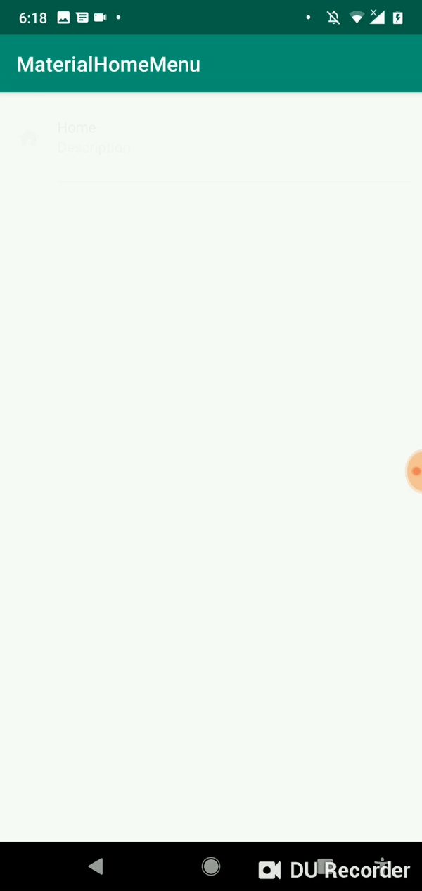
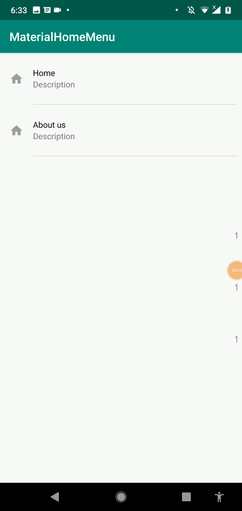
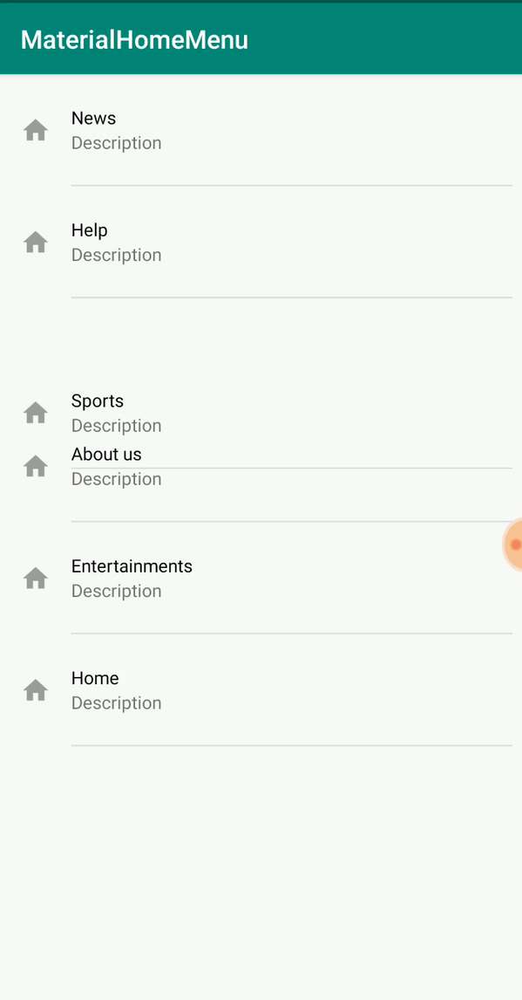
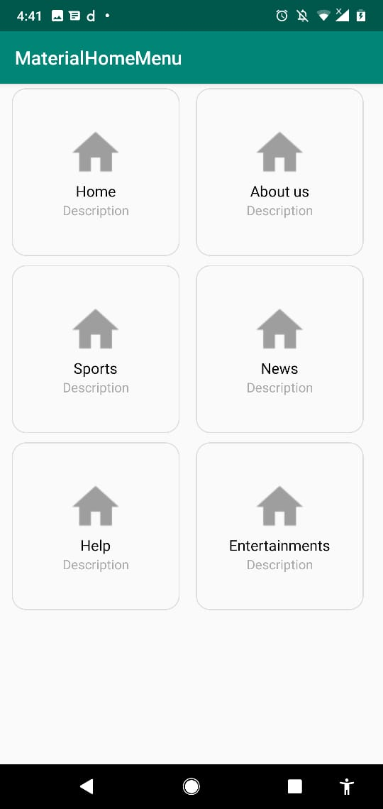
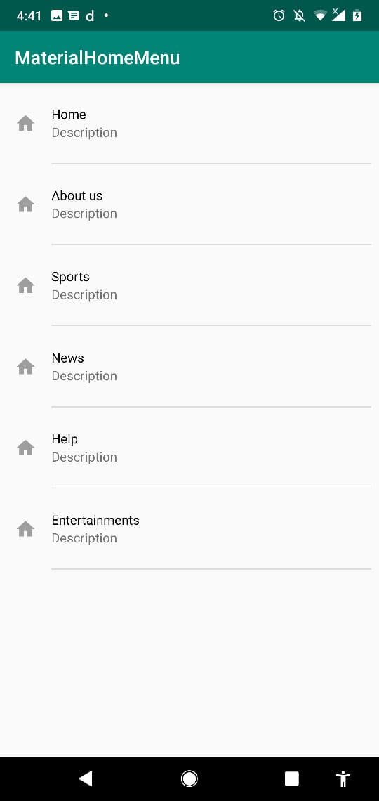
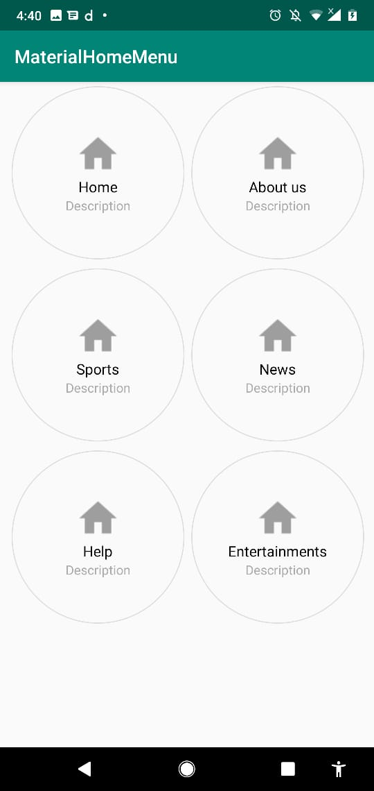
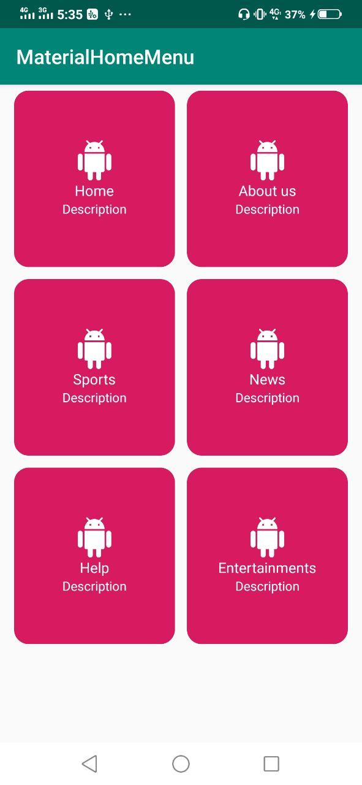

# MaterialHomeMenus(MHM)
[](https://jitpack.io/#MuhammadTouseeq/MaterialHomeMenu-Library-Dragable-)

Material home menu is a android library for creating material design home menus for the app with less code 

<p align="center">
:robot: Pull Requests for Hacktoberfest are Welcomed 
</p>

<br>

<div align="center">
	</img>   
</div>


## Features built in:

1. Material Design HomeMenus
2. Dragable Menus
3. Both Vertical and GridMenu 
4. Hide icon from menu is also available
5. MenuClick event 
6. Animated HomeMenus
7. Multishape drawable for menus

## Screenshots
 


 


## Integration 

Add it in your root build.gradle at the end of repositories:

```
allprojects {
		repositories {
			...
			maven { url 'https://jitpack.io' }
		}
	}
```
### implementation
Just add it to your dependencies
```
  implementation 'com.github.MuhammadTouseeq:MaterialHomeMenu-Library:1.0.3'
```
### For Recycleview (Optional)

```implementation 'androidx.recyclerview:recyclerview:1.0.0'```

### Usage

Extend your class with ``BaseMenuActivity``
```
public class MaterialHomeMenu extends BaseMenuActivity {
```
Pass the ArrayList of HomeMenus 
```
 @Override
    public ArrayList<HomeMenu> getHomeMenuList() {


        ArrayList<HomeMenu> arrData=new ArrayList<>();
       arrData.add(new HomeMenu().setMenuTitle("Home").setMenuDesc("Description").setMenuIcon(R.drawable.ic_home));
        arrData.add(new HomeMenu().setMenuTitle("About us").setMenuDesc("Description").setMenuIcon(R.drawable.ic_home));
        arrData.add(new HomeMenu().setMenuTitle("Sports").setMenuDesc("Description").setMenuIcon(R.drawable.ic_home));
        arrData.add(new HomeMenu().setMenuTitle("News").setMenuDesc("Description").setMenuIcon(R.drawable.ic_home));
        arrData.add(new HomeMenu().setMenuTitle("Help").setMenuDesc("Description").setMenuIcon(R.drawable.ic_home));
        arrData.add(new HomeMenu().setMenuTitle("Entertainments").setMenuDesc("Description").setMenuIcon(R.drawable.ic_home));

        return arrData;
    }


```

## Animation

```
 1. FADE_IN
 2. LEFT_TO_RIGHT
 3. RIGHT_TO_LEFT
 
setAnimation(HomeMenu.MENU_ANIMATION.FADE_IN, 500);

```

## Drwable for Menu

```
 setGridView(true, HomeMenu.DRAWABLE_SHAPE.CUSTOM);
 setShapeDrawable(R.drawable.shape_rounded_base);

```

## Change Menu TextColor

```
 setMenuTextColor(android.R.color.white);
```

## Shapes

```

 1. CIRCLE
 2. ROUNDED
 3. DEFAULT
 setGridView(true, HomeMenu.DRAWABLE_SHAPE.ROUNDED);

```

## show/Hide GridMenu 
just call this function
```
  setGridView(true)
```

## Hide/Show MenuIcon 
just call this function 
```
 setShowMenuIcon(true);
```
OnClickEvent of HomeMenu

```

    @Override
    public void onMenuClick(HomeMenu model, int position) {

        Toast.makeText(this, "Click item is "+model.getMenuTitle(), Toast.LENGTH_SHORT).show();
    }
```
 
## Contributing
Pull requests are welcome. For major changes, please open an issue first to discuss what you would like to change.

Please make sure to update tests as appropriate.

## License
[MIT](https://choosealicense.com/licenses/mit/)
